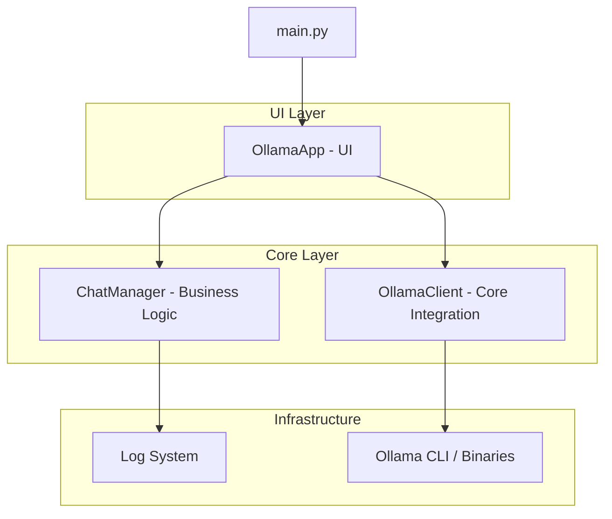

# Llama Educacional

Interface gráfica profissional para interação com modelos de inteligência artificial através do ecossistema Ollama.

## Visão Geral
O Llama Educacional provê uma camada de abstração sobre o Ollama CLI, oferecendo uma experiência de usuário unificada para sistemas Windows e Linux. A arquitetura foi desenvolvida priorizando a separação de responsabilidades e a escalabilidade modular.

## Arquitetura do Sistema


## Componentes Técnicos
- **Modularização:** Divisão clara entre interface (UI), lógica de domínio (Core) e utilitários.
- **Cross-Platform Integration:** Detecção automática de sistema operacional e ajuste de comandos nativos.
- **State Management:** Gerenciamento de múltiplas sessões de chat de forma independente e persistente.
- **Asynchronous Execution:** Processamento de requisições em threads separadas para garantir a fluidez da interface.

## Requisitos de Sistema
- Python 3.10 ou superior.
- Ollama instalado e disponível no PATH global.

## Instalação e Execução
1. Instale as dependências necessárias:
   ```bash
   pip install -r requirements.txt
   ```
2. Inicie o sistema:
   ```bash
   python main.py
   ```

## Estrutura de Diretórios
- `src/core`: Integração com serviços de IA e regras de negócio de chat.
- `src/ui`: Implementação da interface gráfica baseada em CustomTkinter.
- `src/utils`: Helpers para sistema de arquivos, tempo e subprocessos.
- `src/config`: Parametrizador global de limites, temas e caminhos.
- `logs/`: Armazenamento automatizado de sessões em texto simples.

## Desenvolvimento
- **Linguagem:** Python
- **Framework UI:** CustomTkinter
- **Runtime IA:** Ollama

---
Desenvolvido por **Isllan Toso**
[LinkedIn Profile](https://www.linkedin.com/in/isllantoso/)
