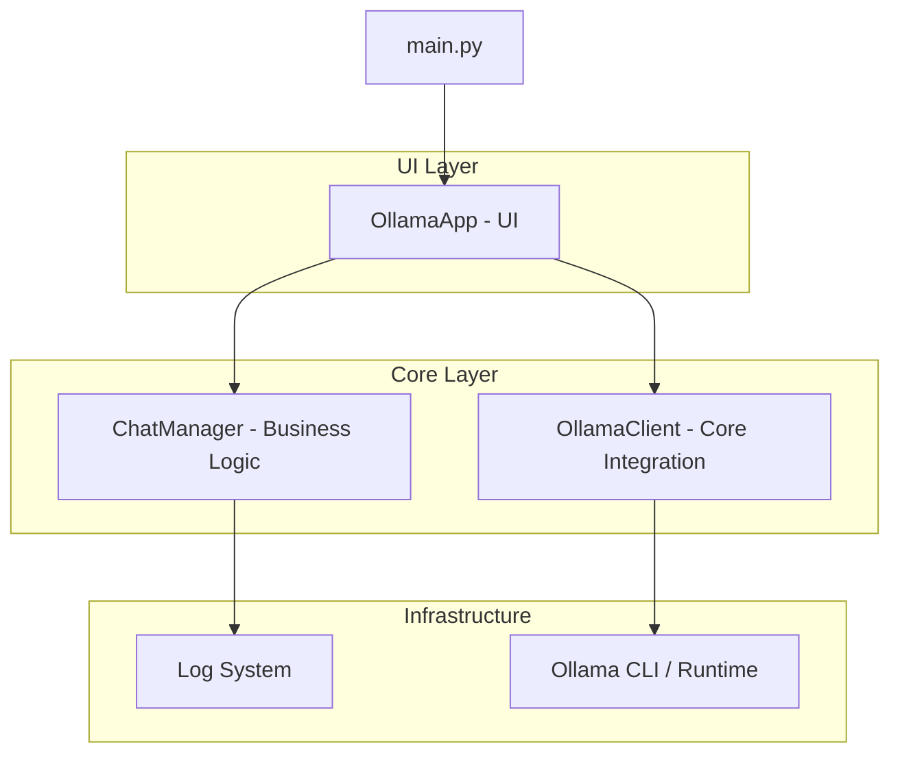

# Local LLM Desktop Platform

Cross-platform desktop interface for interacting with local AI models through the Ollama ecosystem, designed with modular architecture, asynchronous processing and scalable desktop workflows.

The platform provides a unified graphical experience for Windows and Linux environments while abstracting direct interaction with the Ollama CLI.

---

# Overview

This project delivers a structured desktop application layer on top of Ollama, enabling local LLM interaction through a modern GUI architecture focused on maintainability, scalability and runtime stability.

The system was designed around Separation of Concerns (SoC), isolating UI, business logic and infrastructure responsibilities.

---

# System Architecture



---

# Architecture Components

## UI Layer

Responsible for:

- Desktop interface rendering
- User interaction workflows
- Session visualization
- Chat orchestration

## Core Layer

Handles:

- Chat business logic
- Local AI interaction workflows
- Session state management
- Runtime communication abstraction

## Infrastructure Layer

Responsible for:

- Logging system
- Process execution
- Native command handling
- Ollama runtime integration

---

# Technical Features

- Modular desktop architecture
- Cross-platform runtime integration
- Local AI model interaction
- Multi-session chat management
- Persistent conversation workflows
- Asynchronous request processing
- Native Ollama CLI abstraction
- Structured logging system
- Thread-safe UI execution

---

# Technology Stack

| Layer | Technology |
|---|---|
| Language | Python |
| Desktop UI | CustomTkinter |
| AI Runtime | Ollama |
| Runtime Integration | Native CLI/Subprocess |
| Logging | File-based session logs |

---

# Directory Structure

| Path | Description |
|---|---|
| `src/core` | AI integration and business logic |
| `src/ui` | CustomTkinter desktop interface |
| `src/utils` | Utility helpers and subprocess management |
| `src/config` | Global configuration and runtime settings |
| `logs/` | Persistent chat session storage |

---

# Runtime Features

The application includes:

- Automatic operating system detection
- Native command adaptation
- Isolated thread execution
- Independent chat session management
- Persistent text-based logging workflows

---

# System Requirements

- Python 3.10+
- Ollama installed and available in the global PATH

---

# Installation

## Install dependencies

```bash
pip install -r requirements.txt
```

---

# Run Application

```bash
python main.py
```

---

# Engineering Principles

- Separation of Concerns (SoC)
- Modular Desktop Architecture
- Asynchronous Processing
- Cross-Platform Compatibility
- Maintainable Runtime Design
- Scalable Application Structure
- Thread-Safe UI Workflows

---

# Use Cases

- Local AI experimentation
- Desktop LLM interaction
- Offline AI tooling
- Educational AI environments
- Local inference workflows

---

# Future Improvements

Potential platform enhancements:

- Streaming token rendering
- Multi-model orchestration
- Embedded vector search
- Local memory persistence
- Plugin-based runtime extensions
- GPU monitoring integration

---

# License

This project is available under the MIT License.

---

Developed by **Isllan Toso Pereira**

[LinkedIn Profile](https://www.linkedin.com/in/isllantoso/)
